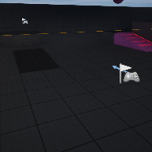

# Project Name  MP_Test

## Description

A github repository for the in class demonstration code, **local multi-player**. The option to "skip assigning gamepad to player 1" is turned ON in project settings, player 1 will be kybd/mouse when player 2 added, player 2 is first gamepad. Add players live by pressing 3 key, or left-special on controller. 
Tested under Mac & Windows with UE 5.4.4 and Xbox wired and wireless controllers. 
Sony DualShock4 controllers can work but require additional setup under Windows, or a shim program.   
 
## Usage
Clone, or download the zip, to a local directory. Open in Unreal Engine 5.4 or newer

## Attributions

